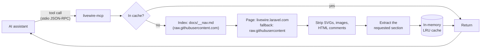

# livewire-mcp

[](https://www.npmjs.com/package/livewire-mcp)
[](https://github.com/ajaymahato431/livewire-mcp/actions/workflows/ci.yml)
[](LICENSE)
[](https://nodejs.org)
[](https://modelcontextprotocol.io)

Livewire 4 introduced single-file components, islands, and a set of directives
and attributes that did not exist in Livewire 2 or 3. An AI assistant trained
before that ships confident, plausible answers using the old API — and has no way
to notice.

**livewire-mcp** is a [Model Context Protocol](https://modelcontextprotocol.io)
server that gives the assistant a way to look it up. It fetches the real Livewire
documentation on demand, strips it to the part that was asked for, and returns
only that. It runs locally, **needs no API key or GitHub token**, and writes
nothing to disk.

---

## Contents

- [How it works](#how-it-works)
- [Requirements](#requirements)
- [Installation](#installation)
- [Connect it to your editor](#connect-it-to-your-editor)
- [Tools](#tools)
- [Configuration](#configuration)
- [Usage examples](#usage-examples)
- [Troubleshooting](#troubleshooting)
- [Upgrading from 1.x](#upgrading-from-1x)
- [Contributing](#contributing)
- [License](#license)

---

## How it works

Two upstream sources are used, each for what it is best at.



| Source | Used for | Why |
| --- | --- | --- |
| `docs/__nav.md` on raw.githubusercontent.com | The page index | It is the site's own navigation, so it carries official categories and real titles, and excludes the repo's internal files. No rate limit, no token. |
| `livewire.laravel.com/docs/<version>/<page>.md` | Page content | Serves the released version as real `text/markdown`. |
| raw.githubusercontent.com | Fallback | Used only when the docs site is unreachable. |

> **Why not the GitHub API?**
> Version 1 built its index by listing the `docs/` directory through
> `api.github.com`, which allows anonymous callers 60 requests an hour — which is
> why it demanded a `GITHUB_TOKEN`. raw.githubusercontent.com has no such limit,
> so version 2 needs no token at all.

---

## Requirements

- **Node.js 20 or later** — check with `node --version`
- An MCP-capable client (Claude Code, Claude Desktop, Cursor, Cline, Windsurf,
  Antigravity, or anything else that speaks MCP)
- Outbound HTTPS access to `livewire.laravel.com` and `raw.githubusercontent.com`

No API key, GitHub token, account, or database is required.

---

## Installation

### Option A — npx (recommended)

Nothing to install. Point your MCP client at `npx` and it fetches the package on
first run. Jump straight to [Connect it to your editor](#connect-it-to-your-editor).

### Option B — global install

```bash
npm install -g livewire-mcp
livewire-mcp --version
```

### Option C — from source

<details>
<summary><strong>Linux and macOS</strong></summary>

```bash
git clone https://github.com/ajaymahato431/livewire-mcp.git
cd livewire-mcp
npm install
node index.js --version
```

</details>

<details>
<summary><strong>Windows (PowerShell)</strong></summary>

```powershell
git clone https://github.com/ajaymahato431/livewire-mcp.git
cd livewire-mcp
npm install
node index.js --version
```

</details>

The server speaks JSON-RPC over stdio. Running `node index.js` by hand will look
like it has hung — it is waiting for a client. Use `--help` to inspect it.

---

## Connect it to your editor

### Claude Code

```bash
claude mcp add livewire-docs -- npx -y livewire-mcp
```

### Claude Desktop

Edit `claude_desktop_config.json`:

- **macOS** — `~/Library/Application Support/Claude/claude_desktop_config.json`
- **Windows** — `%APPDATA%\Claude\claude_desktop_config.json`
- **Linux** — `~/.config/Claude/claude_desktop_config.json`

```json
{
  "mcpServers": {
    "livewire-docs": {
      "command": "npx",
      "args": ["-y", "livewire-mcp"]
    }
  }
}
```

No `env` block is needed — that is the point of this release.

### Cursor

Edit `.cursor/mcp.json` in your project, or `~/.cursor/mcp.json` globally, using
the same `mcpServers` block.

### Cline / Roo (VS Code)

Edit `cline_mcp_settings.json` via **MCP Servers → Configure**, using the same block.

### Antigravity

Edit `~/.gemini/config/mcp_config.json` (on Windows,
`%USERPROFILE%\.gemini\config\mcp_config.json`), using the same block.

### Running from a local clone

```json
{
  "mcpServers": {
    "livewire-docs": {
      "command": "node",
      "args": ["/path/to/livewire-mcp/index.js"]
    }
  }
}
```

Use the full path to your clone. On Windows either escape the backslashes
(`"C:\\path\\to\\livewire-mcp\\index.js"`) or use forward slashes.

### Passing configuration

Every setting is optional:

```json
{
  "mcpServers": {
    "livewire-docs": {
      "command": "npx",
      "args": ["-y", "livewire-mcp"],
      "env": {
        "LIVEWIRE_DOCS_VERSION": "3.x",
        "REQUEST_TIMEOUT_MS": "30000"
      }
    }
  }
}
```

Restart your client after editing its configuration.

---

## Tools

Four tools are exposed. All are read-only.

| Tool | Purpose | Typical cost |
| --- | --- | --- |
| `list_livewire_docs` | Browse the documentation index | ~80 tokens |
| `read_livewire_docs` | Read one page, or one section of it | 200–4,000 tokens |
| `search_livewire_docs` | Find pages by keyword | ~100 tokens |
| `livewire_best_practices` | Curated guidance and anti-patterns | ~150–600 tokens |

### `list_livewire_docs`

| Argument | Type | Default | Description |
| --- | --- | --- | --- |
| `category` | string | — | Category to list. Omit for the summary. `"all"` lists every page (~540 tokens). |
| `limit` | integer | all | Maximum pages to return. |
| `offset` | integer | `0` | Pages to skip, for paging. |

With no arguments it returns a map of the documentation rather than the
documentation itself:

```
# Livewire 4.x documentation
84 pages across 7 categories.

  Getting Started — 3 pages
  Essentials — 9 pages
  Features — 15 pages
  HTML Directives — 25 pages
  PHP Attributes — 18 pages
  Blade Directives — 4 pages
  Advanced — 10 pages
```

### `read_livewire_docs`

| Argument | Type | Default | Description |
| --- | --- | --- | --- |
| `path` | string | **required** | Page path, e.g. `components`, `wire-model`, `islands`. |
| `section` | string | — | Return only this heading's content. |
| `outline` | boolean | `false` | Return only the page's headings. |

Both the published slug and the source filename are accepted, so `morphing` and
`morph` resolve to the same page. An unrecognised path returns close matches
rather than a bare failure.

### `search_livewire_docs`

| Argument | Type | Default | Description |
| --- | --- | --- | --- |
| `query` | string | **required** | Search terms. |
| `maxResults` | integer | `5` | Number of results (`SEARCH_MAX_RESULTS`). |
| `includeContent` | boolean | `false` | Also return the top result's full content. |

### `livewire_best_practices`

| Argument | Type | Default | Description |
| --- | --- | --- | --- |
| `topic` | enum | — | One of `components`, `islands`, `properties`, `actions`, `forms`, `rendering`, `performance`. Omit for all. |

Curated guidance is merged with the official best-practices page when that page
has content, and the `topic` filter applies to the result either way.

---

## Configuration

Precedence is **CLI flag → environment variable → built-in default**.

| Flag | Environment variable | Default | Description |
| --- | --- | --- | --- |
| `--docs-version` | `LIVEWIRE_DOCS_VERSION` | `4.x` | Docs version to read pages from |
| `--github-ref` | `LIVEWIRE_GITHUB_REF` | `main` | Repository ref for the index and fallback |
| — | `GITHUB_TOKEN` | *(unset)* | **Optional.** Only raises a public rate limit |
| `--timeout` | `REQUEST_TIMEOUT_MS` | `15000` | Per-request timeout (ms) |
| `--retries` | `REQUEST_RETRIES` | `2` | Retries for transient failures |
| `--cache-max` | `CACHE_MAX_ENTRIES` | `100` | Maximum cached documents |
| `--doc-ttl` | `DOC_TTL_MS` | `10800000` | Page cache lifetime (3 hours) |
| `--index-ttl` | `INDEX_TTL_MS` | `21600000` | Index cache lifetime (6 hours) |
| `--negative-ttl` | `NEGATIVE_TTL_MS` | `60000` | How long a failed fetch is remembered |
| `--max-results` | `SEARCH_MAX_RESULTS` | `5` | Default search result count |
| `--env-file` | — | — | Load a specific `.env` file |
| `--help` | — | — | Show help and exit |
| `--version` | — | — | Show the version and exit |

### About `GITHUB_TOKEN`

It is **not required**. Set it only if you share an outbound IP with heavy GitHub
traffic and start seeing `429` responses; a read-only token with no scopes is
enough.

There is deliberately no `--github-token` flag: a secret passed as a command-line
argument is visible to anyone who can list processes. Use the environment, or
your MCP client's `env` block.

### Using a `.env` file

```bash
cp .env.example .env
```

Edit it and restart. A missing `.env` is not an error — every value has a
default. Variables already set in the environment (including your MCP client's
`env` block) always win over the file.

`.env` is git-ignored. Only `.env.example`, which contains no secrets, is committed.

### Why there is no Dockerfile

This server is launched as a subprocess by your editor and talks over stdio; it
is not a long-running service. A container would add a process boundary and
startup cost without providing isolation your editor does not already have.
`npx` is the intended distribution.

---

## Usage examples

**Building with a Livewire 4 feature**

> "Search the Livewire docs for islands, then build me a dashboard where only the
> stats panel refreshes."

**Checking a directive's exact behaviour**

> "Read the Livewire docs page for `wire-model` and explain when I need `.live`."

**Reading one section rather than a whole page**

> "Show me just the Validation section of the forms page."

**Working against an older version**

Set `LIVEWIRE_DOCS_VERSION=3.x` for a project still on Livewire 3.

**Calling a tool directly** (from a client that supports it)

```json
{ "name": "read_livewire_docs",
  "arguments": { "path": "properties", "section": "Computed properties" } }
```

---

## Troubleshooting

<details>
<summary><strong>The server does not appear in my client</strong></summary>

Restart the client after editing its configuration — most read it only at
startup. Then check `node --version` is 20 or later, and validate your JSON.

Verify the server runs on its own:

```bash
npx -y livewire-mcp --version
```

</details>

<details>
<summary><strong>"spawn npx ENOENT" on Windows</strong></summary>

Some clients cannot resolve `npx` from a bare name. Use the full path:

```powershell
(Get-Command npx).Source
```

Put that in `command`, or install globally with `npm install -g livewire-mcp`
and use `livewire-mcp` as the command.

</details>

<details>
<summary><strong>I am getting HTTP 429 from GitHub</strong></summary>

Unusual, since the index is read from raw.githubusercontent.com rather than the
rate-limited API. If you are behind a shared or corporate IP, set `GITHUB_TOKEN`
in your client's `env` block. A token with no scopes is sufficient.

</details>

<details>
<summary><strong>Requests time out</strong></summary>

```json
"env": { "REQUEST_TIMEOUT_MS": "45000", "REQUEST_RETRIES": "4" }
```

Behind a corporate proxy, set `HTTPS_PROXY` in the same `env` block.

</details>

<details>
<summary><strong>A page I know exists is reported as missing</strong></summary>

Paths come from the navigation index, so a page absent from the navigation is not
listed. Use `search_livewire_docs`, which suggests close matches. Note that some
pages are published under a different name than their source file — both are
accepted.

</details>

<details>
<summary><strong>I am seeing stale content</strong></summary>

Pages are cached in memory for three hours, the index for six. Restart the server
to clear it, or lower `DOC_TTL_MS` and `INDEX_TTL_MS`.

</details>

<details>
<summary><strong>Responses are too large</strong></summary>

Use `section` to extract one heading, or `outline: true` first to see what the
headings are. Prefer `search_livewire_docs` over `category: "all"`.

</details>

---

## Upgrading from 1.x

- **`GITHUB_TOKEN` is no longer required.** You can delete it from your MCP
  configuration. It is still honoured if present.
- **`list_livewire_docs` with no arguments** now returns a category summary
  instead of every page. Pass `category: "all"` for the old shape.
- **Node.js 20 or later** is required.
- Page titles and the page list have both changed, because they now come from the
  official navigation rather than from directory listing.

If your MCP configuration uses an absolute path to `index.js`, consider switching
to `npx -y livewire-mcp`.

Full details are in the [changelog](CHANGELOG.md).

---

## Related servers

Built on the same core, for the rest of the stack:

- [django-mcp](https://github.com/ajaymahato431/django-mcp) — Django documentation
- [filament-mcp](https://github.com/ajaymahato431/filament-mcp) — Filament documentation

---

## Contributing

Contributions are welcome — see [CONTRIBUTING.md](CONTRIBUTING.md). Please also
read the [Code of Conduct](CODE_OF_CONDUCT.md), and report security issues via
[SECURITY.md](SECURITY.md) rather than a public issue.

```bash
npm test                  # offline unit tests
npm run test:integration  # against the live documentation
```

## License

Released under the [MIT License](LICENSE). © 2026 Ajay Mahato.

Livewire is a trademark of its respective owners. This project is not affiliated
with or endorsed by the Livewire team; it only reads their public documentation.
